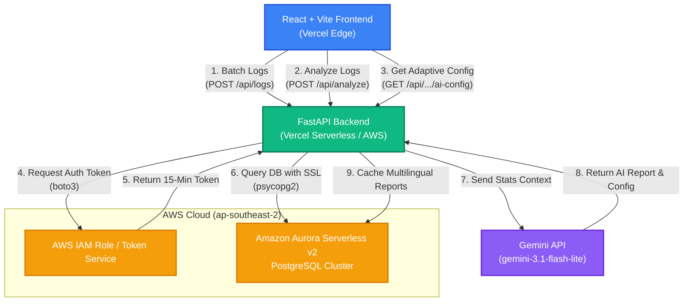

# 🧠 DTx Cognitive SaaS: AI-Powered Digital Therapeutics Platform

> **Built for the AWS Databases & Vercel Hackathon (Track 2: Monetizable B2B App)**  
> A production-ready, closed-loop Digital Therapeutics (DTx) platform designed for clinical cognitive assessment and ADHD intervention.


---

## 🎯 Inspiration

Traditional clinical approaches to cognitive assessment and attention-deficit/hyperactivity disorder (ADHD) training are slow, paper-heavy, and unlocalized. Patients—particularly children—struggle to stay engaged with outdated cognitive training tasks, while clinicians lack real-time access to high-resolution telemetry data. 

Inspired by the rapid growth of _Digital Therapeutics (DTx)_ and the potential of serverless relational databases, we set out to build a secure, multi-tenant B2B SaaS platform that enables closed-loop clinical intervention: where patient game pacing automatically adapts to clinical severity and results are immediately synthesized into multilingual diagnostic summaries.

---

## 🚀 What It Does & Key Features

**DTx Cognitive SaaS** establishes a closed-loop feedback mechanism between the patient terminal and the clinician console:

*   **Gamified Testing Paradigms:** The patient terminal runs three core cognitive tasks targeting sustained attention (Color Go/No-Go), rule flexibility (Reverse Conflict), and response inhibition (Quantity Subitizing).
*   **Real-Time Telemetry Tracking:** The application tracks the exact time-series accuracy and processing speed. 
    For a patient session with $N$ total trials, the overall Accuracy $A$ is calculated as $A = \frac{\sum_{i=1}^{N} C_i}{N} \times 100\%$, where $C_i \in \{0, 1\}$ denotes whether the $i$-th trial is correct.
    The average Reaction Time $RT_{\text{avg}}$ for registered correct hits (where $RT_k > 0$) is calculated as $RT_{\text{avg}} = \frac{1}{|K|} \sum_{k \in K} RT_k$, where $K \subseteq \{1, \dots, N\}$ is the set of correct hit trial indices.
*   **3-Track ADHD Presentation Customization:** 
    *   *Inattentive Type:* Calibrates game sequence to focus on sustained attention: `["CLASSIC", "CLASSIC", "INCONGRUENT"]`.
    *   *Hyperactive-Impulsive Type:* Calibrates game sequence to prioritize motor inhibition: `["SHAPE_COUNT", "SHAPE_COUNT", "INCONGRUENT"]`.
    *   *Combined Type:* Calibrates game sequence to a balanced curriculum: `["CLASSIC", "INCONGRUENT", "SHAPE_COUNT"]`.
*   **Severity-Based Adaptive Pacing (Severity):** Pacing difficulty automatically scales to prevent cognitive overload. The stimulus duration $D_s$ and the error ceiling $E_{\max}$ are dynamically calibrated based on clinical severity:  
    $D_s(\text{Severity}) = \begin{cases} 1500\text{ ms} & \text{if Severity} = \text{Mild} \\\\ 2000\text{ ms} & \text{if Severity} = \text{Moderate} \\\\ 2500\text{ ms} & \text{if Severity} = \text{Severe} \end{cases}$  
    $E_{\max}(\text{Severity}) = \begin{cases} 7 & \text{if Severity} = \text{Mild} \\\\ 5 & \text{if Severity} = \text{Moderate} \\\\ 3 & \text{if Severity} = \text{Severe} \end{cases}$
*   **Clinical-Grade Data Safety & Batch Synchronization:** Logs are cached locally in the patient terminal and uploaded in a single transaction via `POST /api/logs` to prevent concurrency connection storms and database locks.
*   **Asynchronous Race Condition Isolation:** Async state updates on the doctor dashboard are protected using the `active` cleanup hook pattern, preventing stale API responses from corrupting active visualizations.
*   **AI Medical Copilot & Patient Analyzer Agent:** Integrates the Gemini API (`gemini-3.1-flash-lite`) to generate clinical diagnostic summaries, prioritize recommended training modalities, and map target cognitive domains.
*   **Single-Request Multilingual Caching:** Generates full clinical reports for all four languages in a single LLM request. Caches reports locally in AWS databases using composite primary keys `(patient_id, lang)` to support zero-network language toggles on the frontend and minimize API latency.
*   **4-Language Localization & Global Selector:** Supports Chinese (zh), English (en), Tamil (ta), and Malay (ms) instantly via an absolute-positioned glassmorphism dropdown language selector situated at the top-right corner of all portals.

---

## 🏗️ How We Built It & AWS Integration

We built this project using a modern serverless stack:
*   **Frontend:** Built with React + Vite, deployed on **Vercel** for edge-optimized delivery.
*   **Backend:** Designed with Python + FastAPI, utilizing threadpools to execute relational operations without blocking the event loop.
*   **Database (The Core):** Powered by **Amazon Aurora Serverless v2 (PostgreSQL)**. We secure it using IAM Database Authentication via the AWS SDK (`boto3`) to dynamically request a 15-minute temporary database token: $\text{AuthToken} = \text{generate\_db\_auth\_token}(\text{DBHostname}, \text{Port}, \text{DBUsername}, \text{Region})$. This token acts as the database password, requiring no static credentials to be stored.

    ```python
    def get_auth_token():
        client = boto3.client('rds', region_name=REGION)
        return client.generate_db_auth_token(
            DBHostname=DB_HOST,
            Port=DB_PORT,
            DBUsername=DB_USER,
            Region=REGION
        )
    ```

### System Architecture Diagram



---

## 🚧 Challenges We Ran Into

1.  **High Connection Latency over SSL:** Enforcing SSL connection handshake (`sslmode="require"`) on database queries across regions introduced significant latency. To solve this, we implemented SQLAlchemy's dynamic `creator` argument pointing to a connection generator that updates IAM auth tokens only on expiration, avoiding excessive generation overhead.
2.  **Network Connection Storms:** High-frequency game telemetry can lead to hundreds of telemetry events per minute, which could overwhelm database connections. We designed an in-memory batch caching system on the patient terminal that logs game trial arrays locally, uploading the entire collection in a single transaction via `POST /api/logs`.

---

## 🏆 Accomplishments That We're Proud Of

*   **Zero Password DB Infrastructure:** A fully production-ready database connection setup protected strictly under AWS IAM policies.
*   **Closed-Loop Calibration:** Seamless combination of telemetry logs, custom rule engines, and Gemini API to calibrate adaptive thresholds automatically.
*   **Glassmorphic Multi-language Support:** Immediate localization support for English, Chinese, Malay, and Tamil via cache layers.

---

## 📚 What We Learned

*   **Clinical Compliance:** Building digital health software requires prioritizing database transaction safety and user authentication (via RDS IAM).
*   **Relational Optimization:** Relational tables with proper primary keys and indexing (e.g., `(patient_id, lang)`) are highly effective for managing AI-generated cache objects.

---

## 🔮 What's Next for dtx-cognitive-training

*   **Physiological Integration:** Correlating game telemetry with real-time biometric inputs (e.g., heart rate variability and eye-tracking metrics).
*   **Clinical Trials:** Setting up localized clinical studies to evaluate the efficacy of the adaptive pacing formula and validate ADHD symptom reduction.
*   **Database Scaling:** Monitoring and testing Aurora Serverless v2 auto-scaling limits under high concurrent client loads.

---

## 🛠️ Quick Start (Monorepo One-Click Run)

We use `concurrently` to orchestrate both the FastAPI backend and Vite frontend from the root directory.

### Prerequisites
* Python 3.9+
* Node.js 18+
* An active AWS Aurora PostgreSQL connection string

### Setup
```bash
# 1. Clone the repository
git clone https://github.com/your-username/dtx-cognitive-training.git
cd dtx-cognitive-training

# 2. Install root dependencies
npm install

# 3. Setup Backend (FastAPI)
cd dtx-backend
python -m venv venv
source venv/bin/activate  # On Windows: venv\Scripts\activate
pip install -r requirements.txt
cd ..

# 4. Setup Frontend (Vite/React)
cd dtx-frontend
npm install
cd ..

# 5. Run both Frontend & Backend concurrently
npm run dev
```